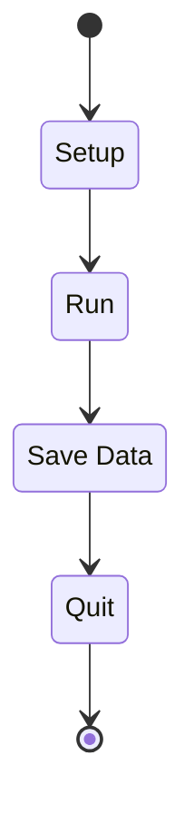
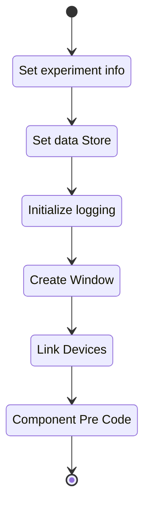
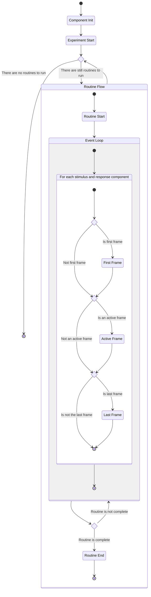
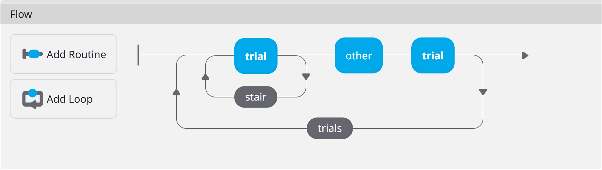

A PsychoPy experiment is a generated python script, which includes all code (hardware, stimulus,
response, storage, etc.) needed for the experiment. A PsychoPy experiment script can be broken into
the following phases, each is executed atomically as described by [Figure 1][explife-fig1-lcoae].

/// caption
{#explife-fig1-lcoae}
Figure 1: Life cycle of an experiment
///

## Setup

In the setup state core data and infrastructure is initialized including:

- Experiment Info: The metadata about this experiment execution. Used within the data storage
    flow.
    - Participant ID: The unique ID for a participant. Default is random.
    - Session ID: The unique ID for the collection session for the participant
- Data Store: The storage locations to be used for storing experiment data. Coupled to 'Experiment
    Info'.
    - Data Directory: Path files will be stored relative to the experiment `.py` file.
    - Data prefix: File name prefix to prepend to each data file generated.
- Logging: The logging object used by each component in the experiment to record technical
  information. Ex. Python error, hardware disconnects, etc.
- Window: The GUI window used to interact with the experiment.
- Device Manager: Contains a reference to the drivers for any hardware devices used within the
    experiment.

Additionally, during the generation phase of experiment creation [components][DD_COMP] have the
opportunity to inject their own setup code (called pre) into this state.

/// caption
{#explife-fig2-lcoaes}
Figure 2: Life cycle of an experiment setup
///

## Run

The run state is the bread and butter of a PsychoPy experiment, contains the "functional"
experimental code. The run state itself is broken in to a number of states as seen in
[Figure 3][explife-fig3-lcotrs]. These states serve as locations where a [component][DD_COMP] can
inject code during the generation phase of experiment creation.

/// caption
{#explife-fig3-lcotrs}
Figure 3: Life cycle of the run state
///

### Component Initialization

Component initialization allows for stimulus and response components to execute code before the
experiment has been marked started.

> [!note]
>
>In this state the experiment window has not been created.

> [!note]
>
> Corresponds to the `writePreCode` hook.

### Experiment Start

The experiment start state give stimulus and response components a chance to execute code just after
the experiment has been marked started.

> [!note]
>
>In this state the experiment window has been created.

> [!note]
>
> Corresponds to the `writeStartCode` hook.

### Routine Flow

The routine flow, as seen in [Figure 4][explife-fig4-flow], is a "queue" (first in first out) of
configured routines for the experiment.

/// caption
{#explife-fig4-flow}
Figure 4: The `Flow` pane from [PsychoPy Studio](https://psychopy.org/about/psychopystudio.html).
///

#### Routine Start

The routine start state gives components a location to inject code before the routine frame event
loop has started.

> [!note]
>
> Corresponds to the `writeRoutineStartCode` hook.

#### Event Loop

Each routine configured for an experiment can be modeled as a simple
[event loop](https://en.wikipedia.org/wiki/Event_loop). Within the event loop components are polled
and potentially triggered each [frame][DD_FRM]. Configured components are processed individually in
the order configured in [PsychoPy Studio](https://psychopy.org/about/psychopystudio.html), see
[Figure 5][explife-fig5-order].

/// caption
{#explife-fig5-order}
Figure 5: The component configuration of a PsychoPy routine. When the routine is executed polling
will happen in this order: 1. fastrak, 2. fastrak2, 3. ledstrip. 
///

> [!note]
>
> Corresponds to the `writeFrameCode` hook.

##### Component Frame Processing

> [!Warning]
>
> The following section describes optional hooks which are found as a part in implementations of the
> `writeFrameCode` hook. Each optional hook divides the frame processing into one of the following
> stages: first frame, active frame, and last frame.

###### First Frame

The "first frame" stage allows for components to inject code to be run on the first frame that the
component should be active. For example, in [Figure 5][explife-fig5-order] fastrak2 will have its
"first frame" when the frames have been processed for 2 seconds. For the other components, `fastrak`
and `ledstrip`, the "first frame" will be the 0 second frame (overall first frame of the routine).
During the first frame stage the component is marked as "active".

###### Active Frame

The "active frame" stage allows for components to inject code to be run on each frame the component
is marked as active.

###### Last Frame

The "last frame" stage allows for components to inject code to be run on the last frame that the
component should be active. For example, in [Figure 5][explife-fig5-order] fastrak2 will have its
"last frame" when the frames have been processed for 4 seconds. For the other components, `fastrak`
and `ledstrip`, the "last frame" will be at the 1 second frame and the 2 second frame respectively.
During the first frame stage the component is marked as "active".

#### Routine End

The routine end state gives components a location to inject code after the routine frame event loop
has ended.

> [!note]
>
> Corresponds to the `writeRoutineStopCode` hook.

## Save Data

The save data state is responsible for committing to storage any non-processed or defend data.

- CSV: The experimental log. Contains timestamps for experimental events such as stimulus onset or
    response events.  

    > [!note]
    >
    > This is different from the log used for logging the experiment state seen in the setup state.

- Pickle: The experimental data as a [Pickle](https://docs.python.org/3/library/pickle.html).

## Quit

The quit state cleans up the experiment terminating any ongoing processes including:

- GUI
- Logging (technical logging of system state and errors seen in the setup state)
- PsychoPy Core
