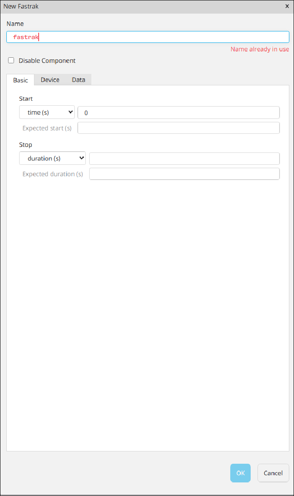
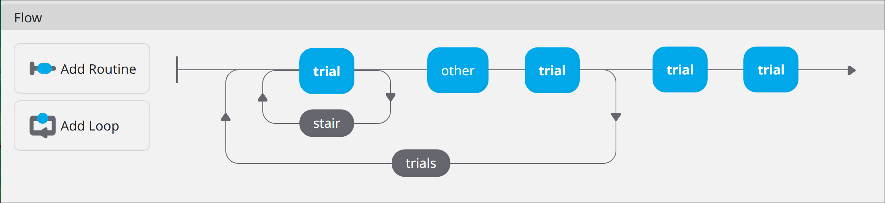

As described in the [data dictionary](../dd) components are the core functional piece of a PsychoPy
experiment, handling all [stimulus][DD_STMCOMP] and [response][DD_RSPCOMP] functionality. In this
development note we outline where some dragons live (in the "hic sunt dracones" sense) when working
with PsychoPy components. We break these into two categories one each for pre- and post- generation
components.  

## Pre-Generation

Pre-generation components are those found in the [PsychoPy Configurator][DD_CFG] and
represent/contain metadata for components before they are generated into an experiment.

/// caption
{#lifespan-fig1-cfgcomp}
Figure 1: List of components available in the configurator  
///

/// caption
{#lifespan-fig2-order}
Figure 2: The component configuration of a PsychoPy routine. Each represents a specific instance of
a component object. Each instance contains individually specific metadata. 
///

### Component Generator Object Instance Lifespan

Instances of component objects in the configurator begin life at one of two times. The earliest is
when the experiment configuration file is loaded. At load time an instance of each object in each
routine is created. The second time an object can be created is when a component is added to a
routine.

Once an object is created it can be modified within the component option menu (Figure 3).

/// caption
{#lifespan-fig3-options}
Figure 3: Configuration options  
///

Component instances are only destroyed when removed from a routine or the configurator is closed.

### Naming

Each configured component must be given an experiment scoped unique name. This includes components
which live in two separate routines.

## Post-Generation

Post generation components are the "functional" components within an experiment script.

### Experiment Component Instance Lifespan

Within an experiment script a component follows the general lifespan seen in the
[experiment life cycle](../0000_exp_lifecycle). The only important edge case to note for the life of
a component in this context is the reuse of names (discussed in
[ADR 00004](../../madr/00004_reuse.md)). As seen in [Figure 4][lifespan-fig4-flow], a PsychoPy
experiment flow can contain multiple instances of the same routine (looped or not).  

/// caption
{#lifespan-fig4-flow}
Figure 4: Experiment flow containing loops and reused routines 
///

When the routine seen in [Figure 4][lifespan-fig4-flow] is generated into a PsychoPy experiment each
instance of `trial` generates the same experimental code. In practice this means that each instance
of `trial` uses the exact same variable names with zero encapsulation.

> [!Note]
>
> A better design for this would be to use/register callbacks into the functional component code
> rather than regenerating for each instance.
