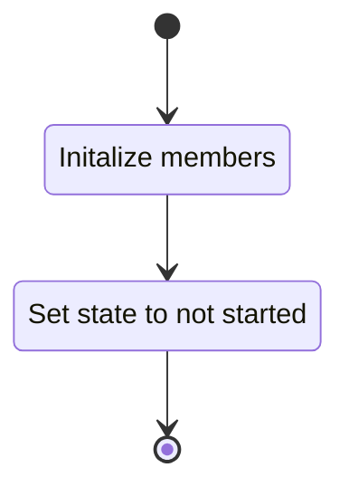
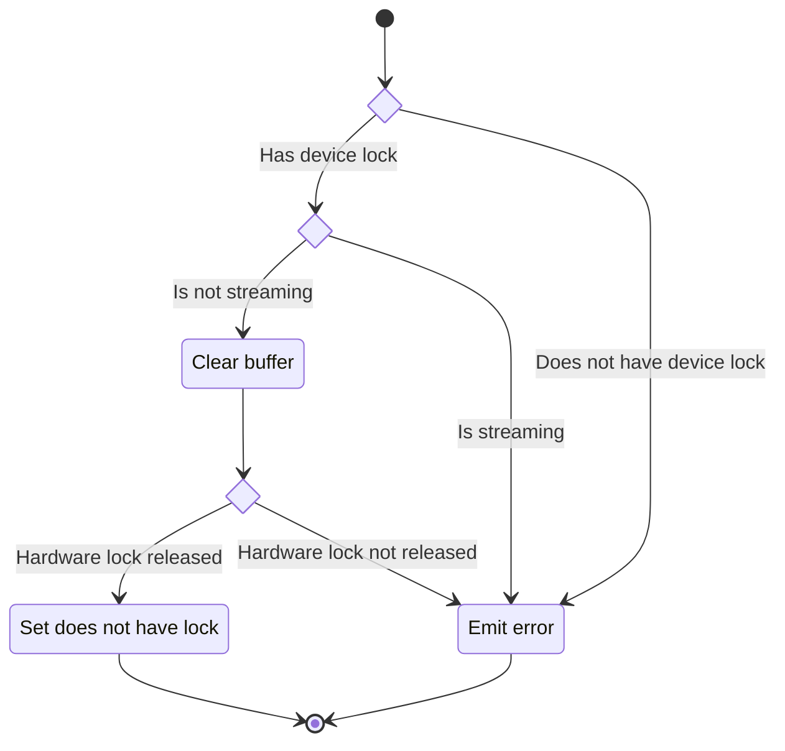
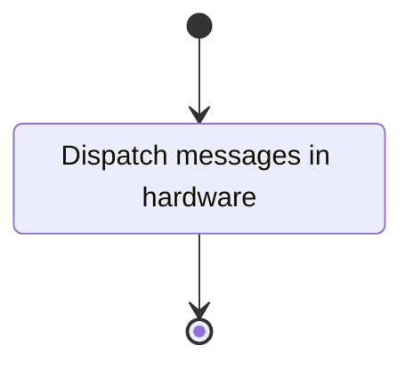
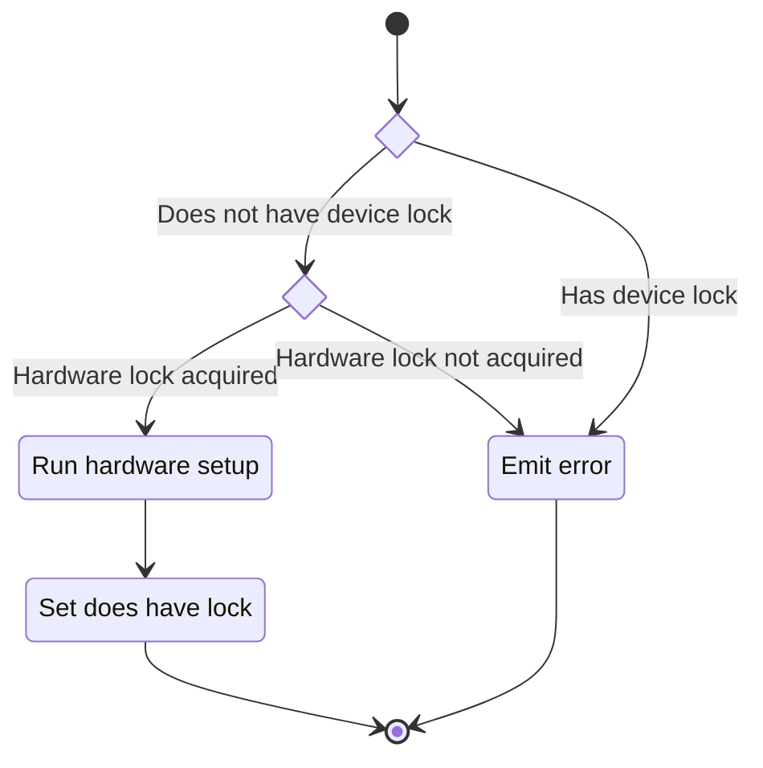
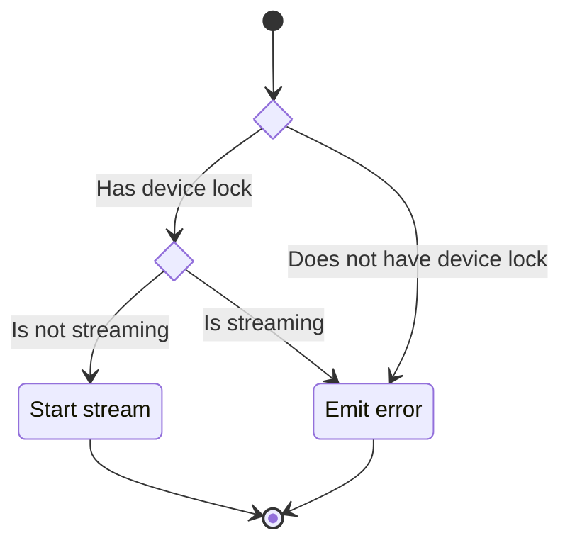
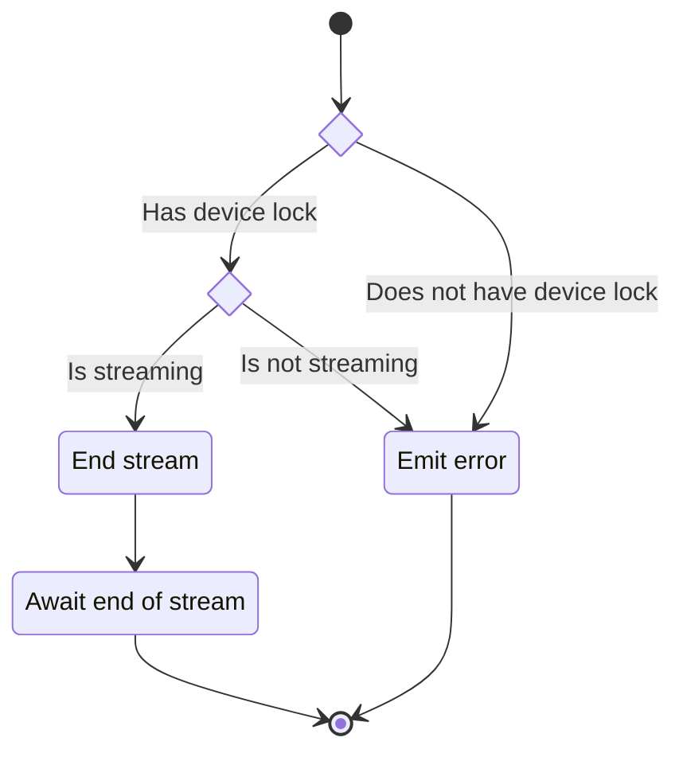
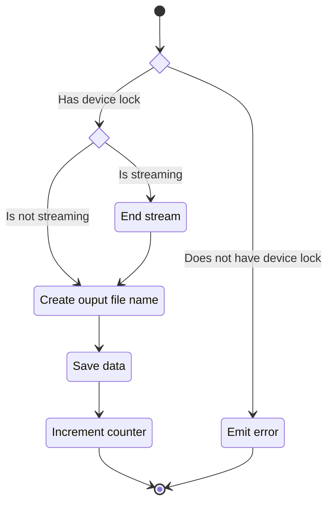

## Description

This unit describes the functionality of the Fastrak component hardware wrapper. The class offers a
simple interface for the Fastrak hardware device to be used in an experiment.

### Members

#### Public Data

##### Status

The `status` is an expected interface for all components in an experiment. The status is essentially
an enum of possible states a component can be in. The status is essentially an enum of possible
states a component can be in. Unfortunately, PsychoPy doesn't use an actual enum for this purpose
but instead a [SimpleNamespace](https://docs.python.org/3/library/types.html#types.SimpleNamespace).

##### Is Streaming

The `is_streaming` member indicates if the wrapped hardware device is streaming.

#### Private Data

- device: A reference to the hardware device that is being wrapped.
- outputPath: The path where the collected data will be stored.  
- hasDeviceLock: Indicates if this component wrapper instance holds the lock on the hardware
    device. Allows multiple components to interact with the same hardware device.
- counter: Counts the number of data collection sessions this component has completed.  

### Interfaces

#### Constructor

The constructor method takes in a collection of data:

- device: The hardware device to wrap.
- outputDir: The output directory for data collected by this wrapper.

##### State Machine

#### Reset

Since wrapper instances are reused between routine instances ([ADR 00004](../../madr/00004_reuse/))
to simplify how this works we reset the state of the wrapper instead of recreate the wrapper.

Takes an optional `outputDir` as an argument allowing for the wrapper to save to a different
location.

##### State Machine

#### Dispatch Messages

PsychoPy has a built-in hardware component messaging service. These services must be polled to
publish state to the "bus".

##### State Machine

#### Startup

The `startup` method sets the state of the wrapped hardware device to the correct settings.
Additionally, acquires a lock on the wrapped device.

##### State Machine

#### Start Stream

The `startStream` method commands the wrapped hardware device to enter streaming mode.

##### State Machine

#### End Stream

The `endStream` method commands the wrapped hardware device to exit streaming mode.

##### State Machine

#### Save Stream

The `saveRecording` method ends the current streaming session (if active) and saves the last
streaming session data to the configured file.  

Takes two optional arguments with types:

- `Experiment`: Metadata object containing the context of the current experiment. If present we
    use the `dataFileName` attribute for naming the output file.
- `Path`: An output base directory. Defaults to the `./data` directory.

> [!note]
> 
> Output path attribute determines where the file should be stored. The data file name is controlled
> by the stream session counter attribute as well as any naming data from the experiment reference
> passed to the save `saveRecording` method.

##### State Machine

